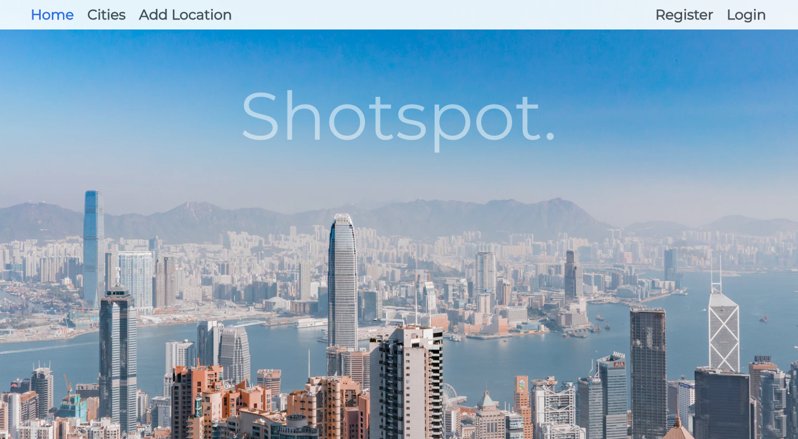
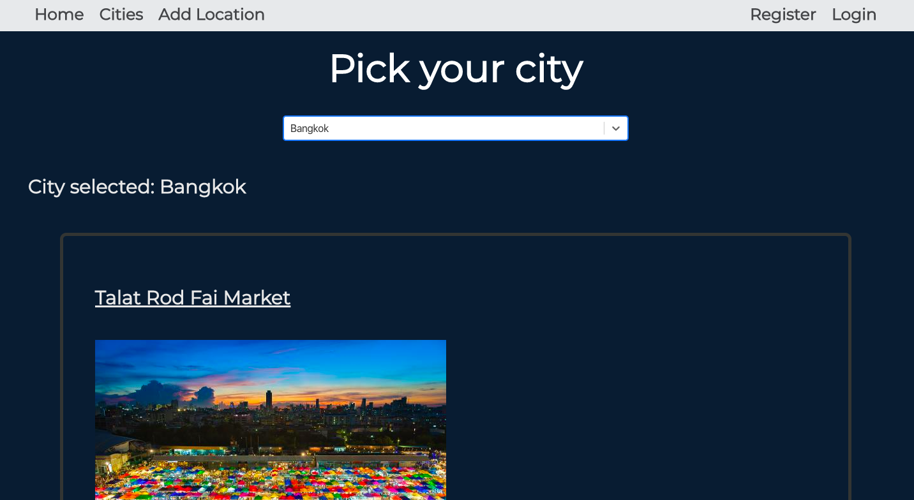
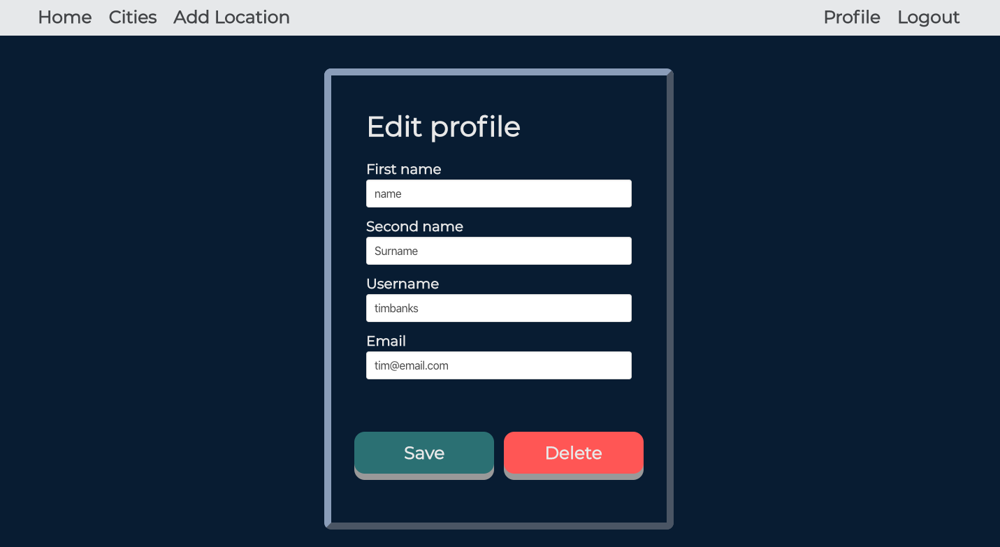
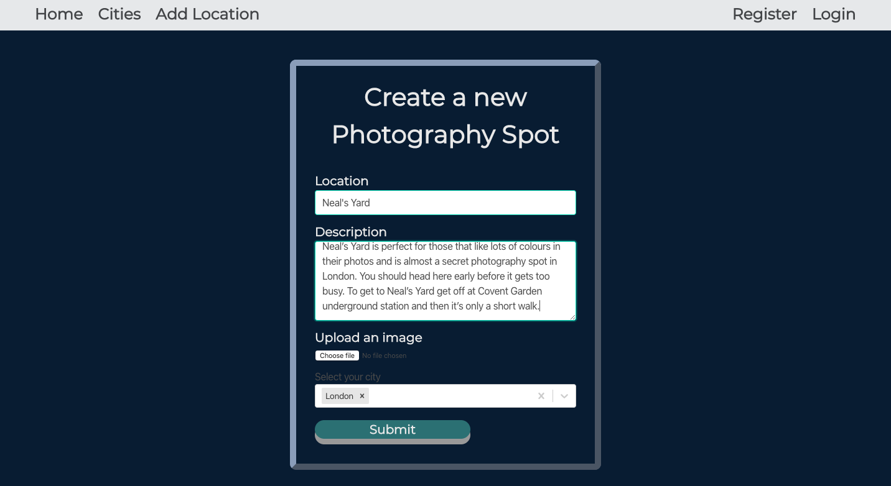
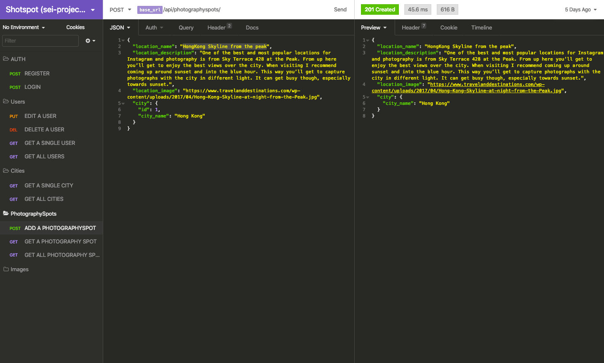
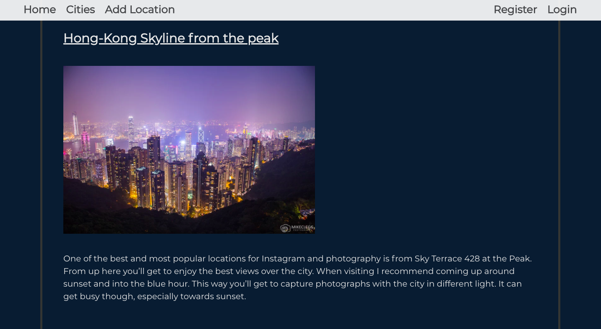

# Software Engineering Immersive: Project 4

This was my fourth and final project on the General Assembly Software Engineering Immersive course. It was a solo project which took place over 7 days.

# Shotspot

Shotspot is a hub for photographers to view and create photography spot locations around the world. 

## Brief

    - Build a full-stack application with backend and frontend using Django with PostgreSQL and React.

    - Work with at least 3 models, incorporating nested or populated serializers / one-to-one and many-to-many models

    - Incorporate CRUD funtionality

    - Consume one or more public APIs

    - Establish a user journey and wireframes that clearly show which elements are MVP (CRUD fucntionality) and which elements are bonus features

    - Deploy the project online 



## Deployment 

The project is deployed online with Heroku and can be found here:

http://shotspot-photography.herokuapp.com/

## Getting started

Use the clone button to download the source code. Enter the following commands in the CLI: 

```
<!— To install all the packages listed in the package.json: —> $ yarn 

<!- Navigate into the shell -> $ pipenv shell

<!— Run the app on localhost:4000 : —> $ yarn serve:back 

<!— Check the console for any issues and if there are any then check the package.json for any dependancies missing —>

<!- Navigate to http://localhost:4000/>
```

## Technologies Used:

1. JavaScript
   * ECMAScript6
   * React
   * axios
2. Python
3. Django
4. PostgresQL
5. Testing
   * Manual: Insomnia
6. SCSS & Bulma
7. HTML5
8. GitHub

### External APIs
- Cloudinary API

## User Experience 

Shotspot is a space for users to view or add the best places to take photos in selected cities. The ideal user is a photographer who is travelling in a limited timeframe (1 - 2 weeks), and wants quick access to the best photography locations in the city they're in.




With full CRUD functionality, the user can add photography spots they've visited, as well as edit / delete their profile (Which would delete any spots they have added themselves) 






The below is a code snippet from the "locationNew" component. It features a multi-select component from React-Select for city chosen, and the URL path for the user to submit their new location.

The handleChange function allows the user to upload the data required for uploading a new photography spot, and handleSubmit specififies where the new spot is being added, as well the URL path to take the user once the new spot has been added.

``` javascript
  componentDidMount() {
    axios.get('/api/cities')
      .then(res => this.setState({ city: res.data }))
      .catch(err => console.log(err))
  }

  handleChange = ({ target: { name, description, image, value } }) => {
    const data = { ...this.state.data, [name]: value, [description]: value, [image]: value }
    const errors = { ...this.state.errors, [name]: '' }
    this.setState({ data, errors })
  }

    handleSubmit = async (e) => {
    e.preventDefault()
    try {
      await axios.post('/api/photographyspots/', this.state.data, {
        headers: { Authorization: `Bearer ${Auth.getToken()}` }
      })
      this.props.history.push('/cities')
    } catch (err) {
      this.setState({ errors: err.response.data.errors })
    }
  }
  ```

The Multi-Select below allows the user to add a city to the location they're adding. You can also see the different backend relationships below in the photographyspot model. The many-to-one relationships with users and cities ensure that each photography spot can only come from a single user, and likewise a city can have many photography spots, but each photography spot can only exist in one city. 

  ``` javascript
    handleMultiSelect = (selected) => {
    if (!selected) {
      return this.setState({ data: { ...this.state.data, city: {} } })
    }
    const data = { ...this.state.data, city: selected.map(sel => sel.city_name) }
    this.setState({ data })
  }
  ```

``` python
class PhotographySpot(models.Model):
    location_name = models.CharField(max_length=50, unique=True)
    location_description = models.CharField(max_length=400, blank=True)
    location_image = models.CharField(max_length=200, blank=True)
    city = models.ForeignKey(
        'cities.City', 
        related_name='photographyspots', 
        on_delete=models.CASCADE,
        default='City',
        blank=True
        )
    user = models.ForeignKey(
        'users.User',
        related_name='users',
        on_delete=models.CASCADE,
        null=True,
        blank=True
    )

    def __str__(self):
        return self.location_name
  ```

  ### Create testing in Insomnia 

  Here is the insomnia POST request showing the new location being added, as well as the new location itself as seen on the frontend 

 

 

## Challenges and Future improvements 

I was pleased with my project overall. My goal was to test as much as I could from everything we learnt in the course, and put my knowledge to the test by delivery this project single-handedly.

A major challenge for me when building this app was getting the backend relationships just right. With three seperate models, there were times when the foreign keys were in the wrong place, and making any changes to this meant dropping & creating the database.

In terms of future improvements, I would have ideally liked to implement a comment model, so users can comment on eachother's photography spots, as well as a map to help users identify exactly where the locations are.

## Wins

A key win for me is having the models working harmoniously, as well as the feature for users to add their own location. This for me was the hardest part, as I ran into some issues with the nested "City" object where the ID wasn't carried across when making a POST request. 

## Key Learnings

A big key learning for me is the importance of planning early and thoroughly. I gave myself two days for planning, but I think this still could've been more thorough to ensure the model relationships were implemented solidly. 

Another key learning is to be more bold when writing code. Writing in Python was slightly new territory for me, and the error messages can be intimidating at times! However, facing bugs head on became an enjoyable process in the end, and there was a lot to be learnt from breaking / fixing things regularly in this project.

